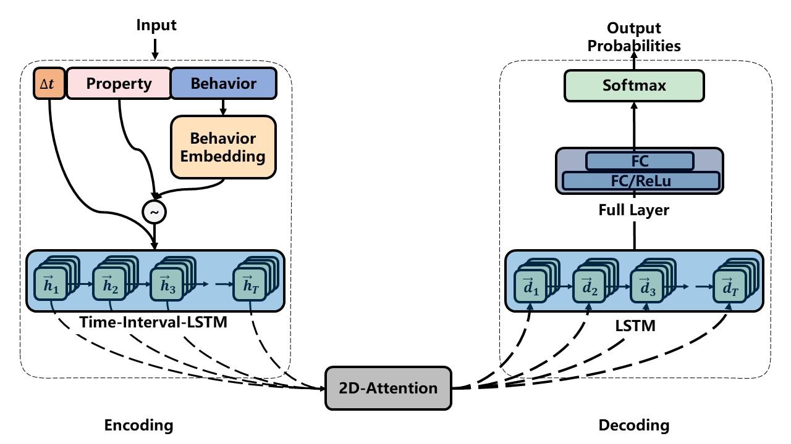
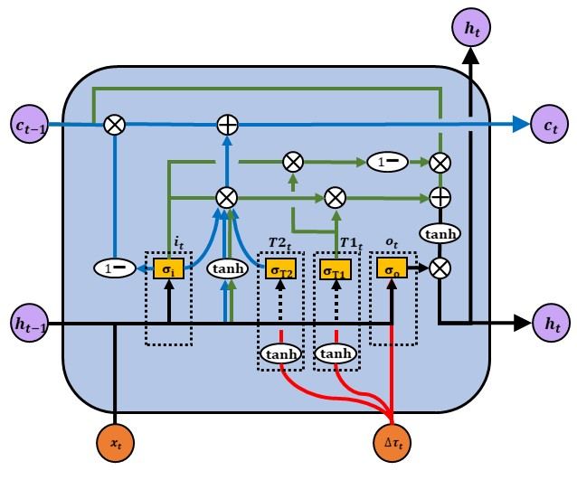

# Time-Interval-LSTM with 2D-Attention (TIL-2DA)
An implementation of Time-Interval-LSTM with 2D-Attention

## From Paper: Event Sequence Learning by Time-Interval-LSTM with 2D-Attention Mechanism
### Introduction
Nowadays, in-store payment through the ad-hoc third-party payment platform becomes prevailing in daily offline consumption market, leading to the reform of payment solutions for the vast majority of offline merchants, meanwhile more illegal trading activities such as gambling, batching attack, and commission arbitrage. It is obvious that minimum cost could be achieved for these platforms if those malicious merchants are perceived in registration precisely before they enter the trading system and conduct real transactions. Generally, the credit investigation in registration relies heavily on expert experience and feature engineering, which can be labor intensive and time consuming. Besides, the inherent dynamic nature of dark industry makes it more difficult to yield an accurate prediction if using conventional credit investigation. Thus, given enough data, it is highly necessary for these third-party payment platforms to concentrate on end-to-end learning rather than focusing on feature engineering.

In this study, we propose a novel end-to-end event sequence learning model - Time-Interval-LSTM with 2D-Attention (TIL-2DA). Basically, TIL-2DA implements an Encoder-Decoder architecture, where an innovative 2D-attention mechanism is developed as the linkage. The 2D-attention mechanism is capable of assigning attention weight of encoder hidden states in both feature and temporal spaces simultaneously. Furthermore, we apply a customized time-interval-LSTM unit that actively simulates the time intervals between neighboring events, such that the underlying correlation between events can be explicitly extracted in both short- and long-term periods. An extensive set of offline experiments based on real-world dataset demonstrate that TIL-2DA obtains better forecast performance over other cutting-edge baseline models. The online test conducted on Alipay indicates that TIL-2DA augments existing decision-making practices of Alipay offline merchant credit investigation in registration. As a result, the precision and recall rate of malicious Alipay offline merchant detection in registration are increased by 4.4% and 9.9% respectively on average.

#### The Architecture of TIL-2DA

#### The Architecture of Time-Interval-LSTM

